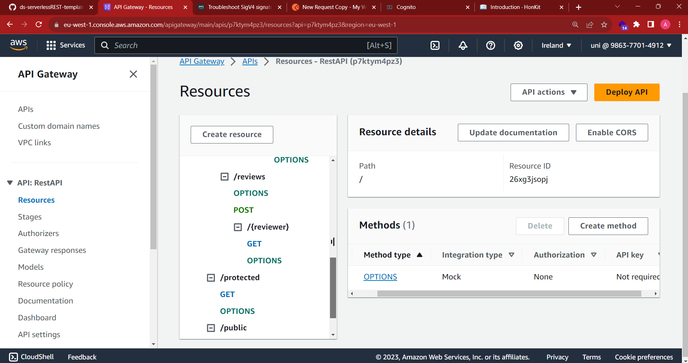

## ServerlessREST Sddignment - Distributed Systems.

__Name:__ Andrew Baxter

This repository contains the implementation of a serverless REST API for the AWS platform. A CDK stack creates the infrastructure. The domain context of the API is movie reviews.

### API endpoints.

[ Provide a bullet-point list of the app's endpoints (excluding the Auth API endpoints).]
e.g.

The following are protected routes that require a jwt
+ POST {{baseURL}}/movies/reviews - adds a review
+ PUT {{baseURL}}/movies/{movieID}/reviews/{reviewer} - updates a review on a movie by a reviewer
+ DELETE {{baseURL}}/movies/{movieID}/reviews/{reviewer} - deletes a review on a movie by a reviewer

the following are unprotected routes

+ {{baseURL}}/movies/{movieID}/reviews - Get the reviews for a specific movie id
+ {{baseURL}}/movies/{movieID}/reviews?year=n - Get the movies by an id, in a specific year.
+ {{baseURL}}/movies/{movieID}/reviews/{reviewer} - get review for a movie id, written by a specified reviewer
+ {{baseURL}}/movies/reviews/{reviewer} -  get all reviews by a specific reviewer
+ {{baseURL}}/movies/{movieID}/reviews?minRating=n -  get all movies by ID that meet the minRating criteria.
+ {{baseURL}}/movies/{movieId}/reviews/{reviewerName}/translation?language=code - gets a translation from a reviewer on a specified movie

[Include screenshots from the AWS console (API Gateway service) that clearly show the deployed API ( have legible font size). ]

### Authentication..

[Include a screenshot from the AWS console (Cognito User Pools) showing a confirmed user account.]

### Independent learning (If relevant).

[ I couldn't get the year working as intended so I done i
State any other evidence of independent learning achieved while completing this assignment.

